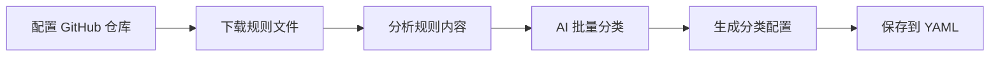
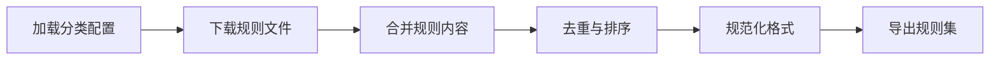

# RuleRefinery

[](https://go.dev/)
[](LICENSE)

RuleRefinery 是一个智能的网络代理规则管理工具，支持从 GitHub 自动抓取规则文件，使用 AI 进行智能分类，并生成优化后的规则集。

## ✨ 核心特性

### 🤖 AI 智能分类

* **多 AI 提供商支持**：集成 OpenAI、DeepSeek、Gemini 和 Grok
* **批量智能分析**：自动分析规则文件内容并按服务类型分类
* **增量更新**：支持加载现有分类配置，仅对新规则进行分类
* **可配置提示词**：自定义 AI 分类提示词以获得最佳分类效果

### 📦 规则集管理

* **多源聚合**：支持从 GitHub、URL 和本地文件加载规则
* **自动去重**：智能去除重复规则，保持规则集精简
* **智能排序**：自动对规则进行排序，提升匹配效率
* **格式规范化**：统一规则格式，确保兼容性
* **Glob 模式匹配**：使用 `**` 递归匹配批量下载规则文件

### 🚀 高性能设计

* **并发下载**：多线程并发下载，提升处理速度
* **批量处理**：支持批量处理规则文件，提高 AI 分析效率
* **代理支持**：内置代理池，支持 SOCKS5/HTTP/HTTPS 代理
* **断点续传**：智能跳过已处理的规则，节省时间

### 🛠️ 灵活配置

* **模块化设计**：AI 分类和规则生成可独立启用或组合使用
* **详细日志**：支持多级别日志输出（Debug/Info/Warn/Error）
* **规则过滤**：支持基于 Glob 模式的白名单和黑名单过滤
* **多种规则类型**：支持 Surge、Clash、QuantumultX 等多种格式

## 📋 使用场景

1. **自动化规则维护**：定期从上游仓库更新规则，保持规则库最新
2. **规则集整理**：将散落的规则文件按服务类型归类整理
3. **规则优化**：去重、排序和规范化现有规则集
4. **私有规则库**：构建自己的规则分类和管理系统

## 🚀 快速开始

### 安装

#### 从源码构建

```Shell
git clone https://github.com/bamzest/rulerefinery.git
cd rulerefinery
go build -o rulerefinery
```

#### 使用 Docker

```Shell
docker build -t rulerefinery .
docker run -v $(pwd)/config.yaml:/app/config.yaml rulerefinery
```

### 基本使用

1. **配置文件**：请查看 `config.yaml` 中的注释了解如何配置各项参数

2. **运行 AI 规则分类**：

```Shell
# 启用 AI 分类（需配置 AI API Key）
./rulerefinery -config config.yaml
```

1. **生成规则集**：

```Shell
# 基于已有分类生成规则集
./rulerefinery -config config.yaml
```

## 📁 项目结构

```
rulerefinery/
├── main.go                     # 程序入口
├── config.yaml                 # 主配置文件
├── Dockerfile                  # Docker 构建文件
├── go.mod                      # Go 模块依赖
├── internal/                   # 内部包
│   ├── ai/                     # AI 客户端实现
│   │   ├── client.go           # AI 客户端接口
│   │   ├── factory.go          # AI 客户端工厂
│   │   ├── deepseek.go         # DeepSeek 实现
│   │   ├── openai.go           # OpenAI 实现
│   │   ├── gemini.go           # Gemini 实现
│   │   └── grok.go             # Grok 实现
│   ├── config/                 # 配置管理
│   │   ├── config.go           # 主配置加载
│   │   └── rules.go            # 规则配置加载
│   ├── github/                 # GitHub 集成
│   │   └── client.go           # GitHub API 客户端
│   ├── loader/                 # 规则加载器
│   │   ├── loader.go           # 通用加载器
│   │   └── rules_loader.go     # 规则集加载器
│   ├── proxy/                  # 代理支持
│   │   └── proxy.go            # 代理池实现
│   ├── rules/                  # 规则处理
│   │   ├── analyzer.go         # 规则分析器
│   │   ├── classifier.go       # AI 规则分类器
│   │   └── optimizer.go        # 规则优化器
│   ├── utils/                  # 工具函数
│   │   └── path.go             # 路径处理
│   └── workflow/               # 工作流
│       ├── generate_rules.go   # AI 分类工作流
│       └── rulesets_classify.go # 规则生成工作流
└── rule_config/                # 规则配置
    ├── classified_rules.yaml   # 分类规则配置
    └── custom/                 # 自定义规则文件
        ├── ai.list
        ├── direct.list
        └── ...
```

## 🔧 工作流程

### 模式 1：AI 智能分类（ai\_classify\_rules）



1. 根据 `config.yaml` 中的 GitHub 仓库配置下载规则文件
2. 分析每个规则文件的内容和示例规则
3. 将规则文件批量提交给 AI 进行智能分类
4. AI 返回分类结果（JSON/YAML 格式）
5. 合并到现有分类配置（增量更新）
6. 保存到指定的输出文件

### 模式 2：规则集生成（generate\_rulesets）



1. 加载 `classified_rules.yaml` 分类配置
2. 从配置的 URL、本地文件和手工规则中加载内容
3. 按规则集名称合并所有规则
4. 自动去重和智能排序
5. 规范化规则格式
6. 导出到指定目录

## 🤖 AI 提供商配置

### DeepSeek

```YAML
ai:
  provider: "deepseek"
  api_key: "${AI_API_KEY}"
  base_url: "https://api.deepseek.com"
  model: "deepseek-chat"
```

### OpenAI

```YAML
ai:
  provider: "openai"
  api_key: "${AI_API_KEY}"
  base_url: "https://api.openai.com/v1"
  model: "gpt-4"
```

### Gemini

```YAML
ai:
  provider: "gemini"
  api_key: "${AI_API_KEY}"
  model: "gemini-pro"
```

### Grok

```YAML
ai:
  provider: "grok"
  api_key: "${AI_API_KEY}"
  base_url: "https://api.x.ai/v1"
  model: "grok-beta"
```

## 📝 规则分类配置格式

```YAML
classified_rules:
  google:
    description: "Google 服务"
    urls:
      - https://raw.githubusercontent.com/.../Google.list
    files:
      - ./custom/google.list
    rules:
      - DOMAIN-SUFFIX,google.com
      - DOMAIN-KEYWORD,google
    exclude_sources:
      - https://example.com/old.list
    filters:
      - "DOMAIN-SUFFIX,*.google.com"
    excludes:
      - "DOMAIN-SUFFIX,*.cn"
```

### 配置字段说明

* `description`: 规则集描述信息
* `urls`: 远程规则文件 URL 列表
* `files`: 本地规则文件路径列表
* `rules`: 手工添加的规则内容
* `exclude_sources`: 要排除的规则来源
* `filters`: 规则内容白名单（Glob 模式）
* `excludes`: 规则内容黑名单（Glob 模式）

## 🔍 规则类型支持

RuleRefinery 支持以下规则格式：

* **Clash Classic**: `DOMAIN`, `DOMAIN-SUFFIX`, `DOMAIN-KEYWORD`, `IP-CIDR`, `IP-CIDR6`
* **Surge**: `DOMAIN`, `DOMAIN-SUFFIX`, `DOMAIN-KEYWORD`, `IP-CIDR`, `IP-CIDR6`, `USER-AGENT`
* **QuantumultX**: `HOST`, `HOST-SUFFIX`, `HOST-KEYWORD`, `IP-CIDR`, `IP6-CIDR`

## 🌐 代理配置

支持多种代理协议：

```YAML
proxy:
  enabled: true
  urls:
    - socks5://127.0.0.1:1080
    - http://127.0.0.1:8080
    - https://proxy.example.com:443
```

代理池会自动轮换，当一个代理失败时会尝试下一个。

## 📊 日志配置

```YAML
logging:
  level: "info"              # 日志级别：debug/info/warn/error
  output_dir: "log"          # 日志目录
  output_file: "app.log"     # 日志文件名
  console_output: true       # 是否输出到控制台
  format: "text"             # 日志格式：text 或 json
```

## 🎯 最佳实践

### 1. 增量更新策略

* 首次运行使用 AI 分类生成完整配置
* 后续运行只处理新增的规则文件
* 定期审查 AI 生成的分类结果并手动调整

### 2. 性能优化

* 调整 `rule_batch_size` 和 `batch_concurrency` 参数
* 使用代理加速 GitHub 文件下载
* 启用文件下载缓存避免重复下载

### 3. 规则维护

* 使用 `exclude_sources` 排除过时的规则源
* 使用 `filters` 和 `excludes` 精确控制规则内容
* 定期运行规则生成以更新规则集

### 4. AI 提示词优化

* 根据规则类型调整提示词
* 提供清晰的分类标准和示例
* 使用 `temperature: 0.0` 获得更稳定的分类结果

## 🤝 贡献

欢迎提交 Issue 和 Pull Request！

## 📄 许可证

本项目采用**非商业开源许可证**（Non-Commercial Open Source License）。

### 主要条款

✓ **允许**：

* 个人、教育和研究用途
* 修改和改进代码
* 非商业性质的分享和分发

✗ **禁止**：

* 商业使用（需要单独的商业许可证）
* 闭源分发（所有衍生作品必须开源）
* 移除或修改许可证

### Copyleft 要求

本项目要求所有衍生作品必须：

1. **开源**：公开完整源代码
2. **使用相同许可证**：衍生作品必须采用相同或兼容的 copyleft 许可证
3. **注明修改**：清楚标注所有修改内容
4. **网络服务开源**：如果用于提供网络服务，必须向用户提供源代码

### 商业使用

如需商业使用，请联系项目维护者获取商业许可证。

详见 [LICENSE](LICENSE) 文件了解完整条款。

## 🙏 致谢

* [blackmatrix7/ios\_rule\_script](https://github.com/blackmatrix7/ios_rule_script) - 优质的规则源
* [ACL4SSR/ACL4SSR](https://github.com/ACL4SSR/ACL4SSR) - Clash 规则集
* 所有 AI 提供商的 API 支持

## 📮 联系方式

如有问题或建议，请通过以下方式联系：

* 提交 [Issue](https://github.com/bamzest/rulerefinery/issues)
* 发起 [Discussion](https://github.com/bamzest/rulerefinery/discussions)

***

⭐ 如果这个项目对你有帮助，请给一个 Star！
